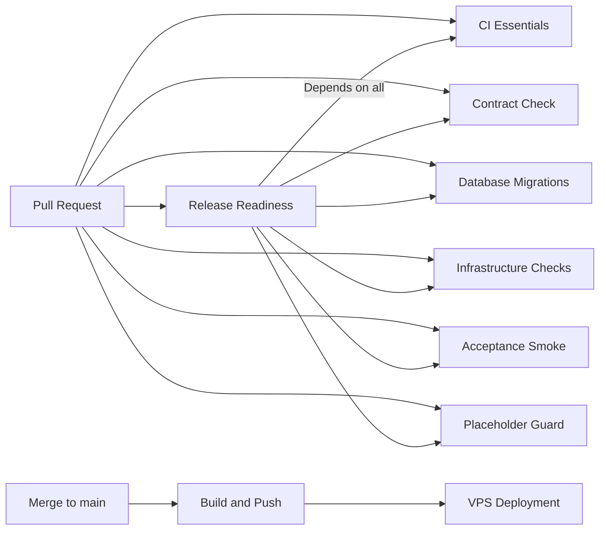

# CI Pipeline Documentation

## Overview

Fleet uses GitHub Actions for continuous integration with comprehensive checks to ensure code quality, deployment readiness, and operational safety.

## Pipeline Structure

### Core Pipelines

#### 1. CI Essentials (`ci.yml`)
**Trigger**: Every pull request and push to main
**Purpose**: Core code quality checks

**Jobs**:
- **TypeScript Compilation** - Ensures code compiles without errors
- **Unit Tests** - Runs test suite with coverage reporting
- **Linting** - Code style and quality checks
- **Build Validation** - Ensures applications build successfully

**Fix when red**:
- TypeScript errors: Fix type issues in source code
- Test failures: Debug and fix failing tests
- Lint errors: Run `npm run lint -- --fix` locally
- Build failures: Check for missing dependencies or compilation issues

#### 2. Contract Check (`contract-check.yml`)
**Trigger**: Changes to OpenAPI spec or generated client files
**Purpose**: Prevents OpenAPI client drift

**Jobs**:
- **OpenAPI Validation** - Validates spec syntax
- **Client Generation** - Regenerates clients and checks for drift
- **Drift Detection** - Fails if generated files don't match spec

**Fix when red**:
```bash
# Regenerate clients after OpenAPI changes
./scripts/generate-openapi-clients.sh

# Commit all generated files
git add apps/ui/src/lib/api/gen/ apps/ui/src/lib/api/generated/
git commit -m "fix: regenerate OpenAPI clients"
```

#### 3. Database Migrations (`database-migrations.yml`)
**Trigger**: Changes to Prisma schema or migration files
**Purpose**: Validates database schema changes

**Jobs**:
- **Migration Validation** - Applies migrations to clean database
- **Smoke Tests** - Basic database operations
- **Schema Drift Check** - Ensures schema matches migrations

**Fix when red**:
```bash
# Create missing migration
cd apps/api
npx prisma migrate dev --name describe_your_changes

# Reset if migrations are broken
npx prisma migrate reset
npx prisma migrate dev
```

#### 4. Infrastructure Checks (`infrastructure-checks.yml`)
**Trigger**: Changes to deployment configs, Caddyfiles, or inventory
**Purpose**: Prevents configuration drift and validates infrastructure

**Jobs**:
- **Port Drift Check** - Ensures Caddy upstreams match container ports
- **Compose Validation** - Validates Docker Compose syntax
- **Caddy Validation** - Validates Caddyfile syntax
- **Inventory Sync** - Ensures device inventory matches monitoring targets

**Fix when red**:
- Port drift: Update either `infra/vps/compose.fleet.yml` or `infra/vps/caddy.fleet.Caddyfile`
- Compose errors: Fix syntax in Docker Compose files
- Caddy errors: Fix syntax in Caddyfile
- Inventory sync: Update target files to match `inventory/device-interfaces.yaml`

#### 5. Acceptance Smoke Tests (`acceptance-smoke.yml`)
**Trigger**: Changes to API or UI code
**Purpose**: Validates endpoint existence and parameter compatibility

**Jobs**:
- **Module Smoke Matrix** - Tests each module (audio, video, zigbee, camera, logs, fleet)
- **UI ↔ API Drift Check** - Detects parameter mismatches

**Fix when red**:
- Missing endpoints: Implement required API endpoints
- Parameter mismatches: Ensure UI sends correct parameters
- Legacy endpoint usage: Update UI to use current API paths

#### 6. Placeholder Guard (`placeholder-guard.yml`)
**Trigger**: Changes to application code
**Purpose**: Ensures critical workflows are either implemented or feature-flagged

**Jobs**:
- **Unguarded Placeholder Check** - Finds TODO implementations without guards
- **Feature Flag Validation** - Ensures all referenced flags are defined

**Fix when red**:
```typescript
// Add feature flag protection
import { guardPlaceholder } from '../config/feature-flags';

export function uploadAudio() {
  guardPlaceholder(
    'AUDIO_UPLOAD_ENABLED',
    'Audio upload not yet implemented',
    'Planned for v2.1'
  );
  // Implementation...
}
```

#### 7. Release Readiness (`release-readiness.yml`)
**Trigger**: Every pull request
**Purpose**: Generates deployment readiness report

**Jobs**:
- **Readiness Assessment** - Checks all components for deployment readiness
- **Report Generation** - Creates comprehensive readiness artifact
- **PR Comments** - Posts summary to pull request

**Fix when red**: Address specific issues mentioned in the readiness report

### Post-Merge Pipelines

#### 8. Build and Push (`build-and-push.yml`)
**Trigger**: Push to main branch
**Purpose**: Builds and publishes container images

**Jobs**:
- **Multi-platform Build** - Builds for AMD64 and ARM64
- **Registry Push** - Pushes to GitHub Container Registry
- **Deployment Artifacts** - Generates deployment manifests

**Images produced**:
- `ghcr.io/org/fleet-api:main-{sha}`
- `ghcr.io/org/fleet-ui:main-{sha}`

## Workflow Dependencies



## Status Checks

### Required for Merge
All of these must pass before a PR can be merged:

- ✅ CI Essentials
- ✅ Contract Check
- ✅ Database Migrations
- ✅ Infrastructure Checks
- ✅ Acceptance Smoke Tests
- ✅ Placeholder Guard
- ✅ Release Readiness

### Branch Protection Rules
- Require status checks to be up to date
- Require review from code owners
- No admin bypass allowed
- Dismiss stale reviews when new commits are pushed

## Artifacts and Reports

### Generated Artifacts

#### Release Readiness Report
- **Location**: GitHub Actions artifacts
- **Contents**: Complete deployment readiness assessment
- **Usage**: Review before merging, reference for deployment

#### Deployment Manifest
- **Location**: Generated after merge to main
- **Contents**: Image tags, deployment commands, environment variables
- **Usage**: VPS deployment instructions

#### Placeholder Report
- **Location**: Generated on placeholder guard failures
- **Contents**: Feature flag usage, unguarded implementations
- **Usage**: Technical debt tracking

### Accessing Artifacts

1. Go to the GitHub Actions tab
2. Select the workflow run
3. Scroll to "Artifacts" section
4. Download the relevant artifact

## Environment Variables

### CI Configuration
```bash
# Feature flag overrides
FEATURE_FLAG_AUDIO_UPLOAD_ENABLED=true

# Mock service control
VITE_USE_MOCKS=1

# Database for testing
DATABASE_URL=file:./test.db
```

### Container Registry
- **Registry**: `ghcr.io`
- **Authentication**: Automatic via `GITHUB_TOKEN`
- **Permissions**: Managed by repository settings

## Troubleshooting

### Common Issues

#### 1. OpenAPI Drift
**Symptoms**: Contract check fails with "drift detected"
**Solution**: Run `./scripts/generate-openapi-clients.sh` and commit files

#### 2. Port Mismatch
**Symptoms**: Infrastructure check fails with port drift
**Solution**: Align ports between Caddy config and Docker Compose

#### 3. Missing Migrations
**Symptoms**: Database migration check fails
**Solution**: Create migration with `npx prisma migrate dev`

#### 4. Unguarded Placeholders
**Symptoms**: Placeholder guard fails
**Solution**: Add feature flag protection to TODO implementations

#### 5. Inventory Sync Issues
**Symptoms**: Infrastructure check fails on inventory sync
**Solution**: Update Prometheus target files to match device inventory

### Getting Help

- **Documentation**: See individual workflow files for detailed steps
- **Logs**: Check GitHub Actions logs for specific error messages
- **Artifacts**: Download reports for detailed analysis
- **Code Owners**: Ping relevant team members based on failed check

## Performance Optimization

### Caching Strategy
- **Node modules**: Cached by setup-node action
- **Docker layers**: Cached using GitHub Actions cache
- **Prisma client**: Generated once per workflow run

### Parallelization
- Status checks run in parallel where possible
- Matrix strategy used for multi-module smoke tests
- Multi-platform builds run concurrently

### Timeout Management
- Most jobs timeout after 15 minutes
- Build jobs allow up to 30 minutes for ARM64 compilation
- Artifact retention set to 30 days